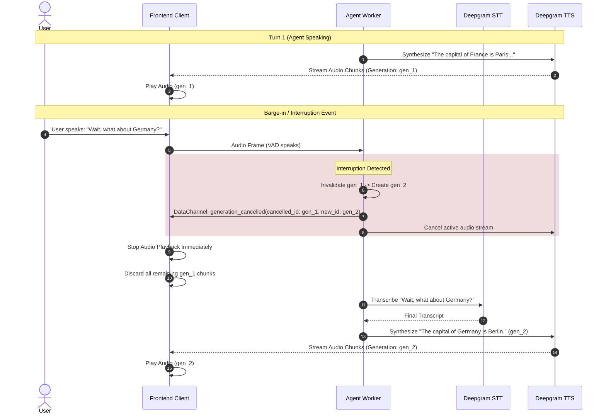

# Vocal-Voice: High-Performance Real-Time Voice Agent Architecture

## 1. System Overview & Latency Budget

Vocal-Voice is an ultra-low-latency real-time voice assistant architecture engineered for conversational human-AI interactions. The pipeline achieves **sub-500ms End-to-End (E2E) conversational turnaround** using WebRTC streaming, tight audio endpointing, streaming LLM token generation, and real-time TTS audio chunk synthesis.

```
+───────────────────────────────────────────────────────────────────────────────────────────+
|                                    LATENCY BUDGET WATERFALL                                |
+───────────────────────────────────────────────────────────────────────────────────────────+
| [0ms] User stops speaking                                                                 |
|   ├── [0-25ms] WebRTC Media Transport (Opus 48kHz audio frames via LiveKit SFU)           |
|   ├── [25-135ms] Deepgram STT (nova-3 streaming endpointing & final transcript)   (~110ms)|
|   ├── [135-136ms] Input Guardrails (<1ms fast memory classifier)                          |
|   ├── [136-320ms] Groq LLM (gpt-oss-20b streaming token TTFT)                     (~185ms)|
|   ├── [320-405ms] Deepgram TTS (aura-2-andromeda-en streaming TTFB)                (~85ms)|
|   └── [405-435ms] WebRTC Downlink & Local Audio Buffer Playback                    (~30ms)|
+───────────────────────────────────────────────────────────────────────────────────────────+
| TOTAL END-TO-END LATENCY: ~435ms (Target: <500ms)                                         |
+───────────────────────────────────────────────────────────────────────────────────────────+
```

---

## 2. Core Architectural Components

```mermaid
flowchart TD
    subgraph Client ["Frontend Client (React + LiveKit Web SDK)"]
        UI[User Interface & Visualizer]
        Mic[User Microphone Capture]
        Speaker[Room Audio Renderer]
        DataRecv[Data Channel Demux & Dedup]
        GhostGuard[Ghost Audio & Generation Filter]
        MetricsUI[Live Latency Breakdown & Health Pills]
    end

    subgraph LiveKitCloud ["LiveKit Cloud / Media Server"]
        SFU[LiveKit Selective Forwarding Unit]
        RTC_Audio_Up[WebRTC Audio Uplink]
        RTC_Audio_Down[WebRTC Audio Downlink]
        RTC_Data[WebRTC Data Channel]
        AgentDispatch[Agent Dispatcher Queue]
    end

    subgraph FastAPIServer ["Backend REST API (FastAPI)"]
        TokenAPI["/api/token (JWT + Dispatch)"]
        AgentAPI["/api/agents (Agent CRUD)"]
        HealthAPI["/api/health (Diagnostics)"]
        LogSink["/api/frontend-logs"]
        AgentsDB[("agents.json / Storage")]
    end

    subgraph AgentWorker ["Python Agent Worker (livekit-agents)"]
        SessionManager[AgentSession Coordinator]
        Guardrails[Input Safety Guardrails]
        MemoryManager[Sliding Window Context (5-10 Turns)]
        GenManager[Generation ID & Cancellation Engine]
        TelemetryEngine[Latency Telemetry & Metrics Publisher]
    end

    subgraph CloudAI ["AI Inference Providers"]
        STT["Deepgram STT (nova-3 streaming)"]
        LLM["Groq LLM (gpt-oss-20b primary / 120b fallback)"]
        TTS["Deepgram TTS (aura-2 streaming)"]
        Tools["Tavily Search API (Real-time web)"]
    end

    %% Audio & Signaling Flow
    Mic -->|Opus Frames| RTC_Audio_Up --> SFU
    SFU --> SessionManager
    SessionManager --> STT
    STT -->|Interim & Final Transcripts| SessionManager
    SessionManager --> Guardrails --> LLM
    LLM -->|Streamed Tokens| TTS
    TTS -->|Raw PCM/Opus| SFU --> RTC_Audio_Down --> GhostGuard --> Speaker

    %% Telemetry & Signaling Flow
    TokenAPI --> AgentDispatch --> AgentWorker
    GenManager -->|Cancel Event| RTC_Data
    TelemetryEngine -->|Turn Metrics & Interim Text| RTC_Data
    RTC_Data --> DataRecv --> GhostGuard
    DataRecv --> MetricsUI
    DataRecv --> UI
```

---

## 3. Detailed Component Breakdown

### 3.1 REST API Layer (FastAPI)
- **Authentication & Token Generation (`/api/token`)**:
  - Validates room name and participant identity.
  - Generates signed LiveKit JWT Access Tokens with audio publishing and subscribing grants.
  - Directly triggers `LiveKitAPI.agent_dispatch.create_dispatch()` to allocate a warm worker instance from the pool.
- **Agent Lifecycle (`/api/agents`)**:
  - Handles agent configuration: persona prompt, objective, knowledge reference documents (PDF/TXT extraction via `pypdf`).
  - Layer-1 Guardrail: Scans prompts at creation time for injection patterns and system instruction overrides.
- **Diagnostics & Health (`/api/health`)**:
  - Real-time pipeline status checks across WebRTC credentials, STT, LLM, TTS, and Tavily integrations.
- **Log Aggregation (`/api/frontend-logs`)**:
  - Flushes browser telemetry batches to persistent server storage (`frontend.log`).

### 3.2 WebRTC & WebSocket Transport
- **Audio Channels**:
  - Full-duplex WebRTC audio track (Opus 48kHz, mono/stereo with DTX and AEC).
  - Dynamic jitter buffer mitigation for real-time speech.
- **LiveKit Data Channel (Reliable Transport)**:
  - Transports lightweight, structured JSON control packets:
    1. `turn_metrics`: Millisecond timestamps (`stt_ms`, `llm_ttft_ms`, `tts_ttfb_ms`, `e2e_ms`).
    2. `generation_cancelled`: Invalidation signals instructing the frontend to discard stale audio and interim bubbles.
    3. `interim_transcript`: Real-time partial STT results for live streaming text.
    4. `final_transcript`: Committed turn dialogs.
    5. `pipeline_health`: Worker health heartbeat.

### 3.3 Worker Pool & Queue Architecture
- **Multi-Process Architecture**:
  - Pre-forked worker pool based on CPU core count (`WorkerOptions(num_idle_processes=N)`).
  - Isolates active calls in dedicated async event loops.
- **Agent Dispatch**:
  - Dispatches `vocal-agent` on demand when client requests a room token.
  - Auto-subscribes to participant audio tracks with zero negotiation latency.

### 3.4 Session State & Sliding Memory Window
- **Context Preservation**:
  - Base Safety Prompt is permanently prepended and immutable.
  - Sliding Window: Keeps the immutable system prompt + the latest 10 messages (5 user-assistant dialog turns).
  - Truncation via `agent.chat_ctx.truncate(max_items=10)` prevents token overflow (staying well within Groq's 8,000 TPM limit) while preserving immediate conversational continuity.

---

## 4. Ghost-Audio Prevention & Barge-In Protocol

Ghost-audio occurs when the agent is synthesizing or streaming audio for Turn $N$, but the user interrupts (Turn $N+1$). Stale audio packets in transit or in the browser's playback buffer can cause jarring overlapping audio.



### Protocol Invariants:
1. Every speech response is stamped with a unique `generation_id` (`f"gen_{turn}_{uuid}"`).
2. When the user state transitions to `speaking`, the agent worker immediately issues a `generation_cancelled` event over the data channel.
3. The frontend maintains `cancelledGenerations` set and immediately flushes active audio buffers and interim text associated with the cancelled generation.

---

## 5. Error Recovery, Backpressure & Timeout Behaviors

| Subsystem | Failure Scenario | Detection Mechanism | Recovery & Graceful Degradation |
| :--- | :--- | :--- | :--- |
| **Microphone** | Permission denied or detached device | `navigator.mediaDevices.getUserMedia` catch | Actionable recovery modal; instructions to re-enable mic in browser settings. |
| **WebRTC** | ICE failure or network disconnect | `LiveKitRoom.onError` & `ConnectionState` | Auto-reconnect with exponential backoff (1s, 2s, 4s) + manual reconnect button. |
| **STT** | Deepgram timeout or rate limit | Absence of transcription > 4s after silence | Agent prompts: *"I didn't quite catch that, could you repeat?"* |
| **LLM** | Groq primary rate limit / timeout | `FallbackAdapter` trigger | Automatically fails over to `gpt-oss-120b` or fallback model with zero dropped turns. |
| **Slow TTS** | Deepgram synthesis jitter (>1.5s) | Telemetry timer threshold | Visual status banner warning user of network/synthesis delay; buffer coalescing. |
| **Data Messages** | Out-of-order or duplicate packets | Monotonic sequence counter (`seq`) | Drop packets where `seq <= last_seen_seq` to guarantee order integrity. |

---

## 6. Retention & Database Topology

- **In-Memory Worker State**: Active `AgentSession` keeps conversation turns and latency metrics in async memory.
- **Local Persistence**: `agents.json` stores agent personas, system prompts, and extracted document references.
- **Client Reactive State**: Stores full session history (up to 10 latest dialog turns) with turn latency breakdowns, roles, and status flags.
