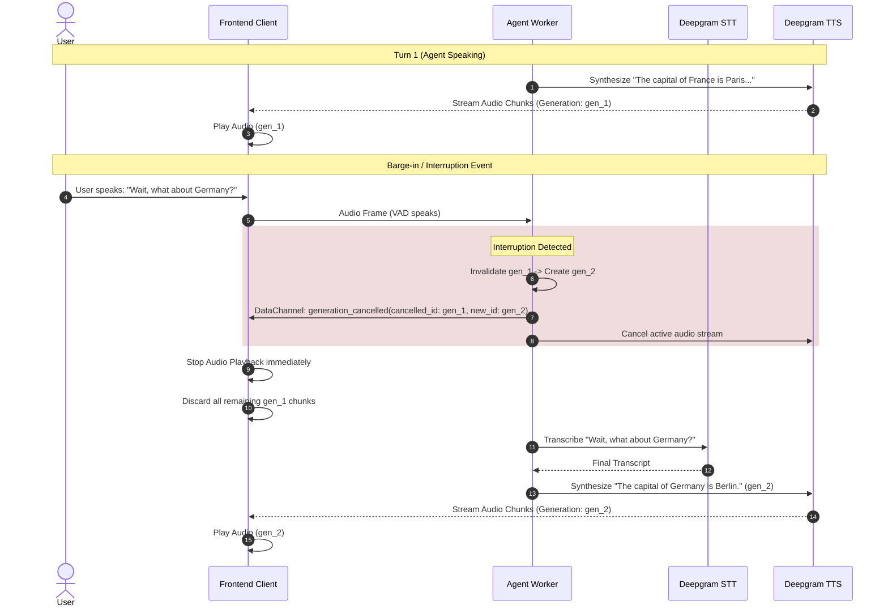

# Vocal-Voice: High-Performance Real-Time Voice Agent Architecture

## 1. System Overview & Latency Budget

Vocal-Voice is an ultra-low-latency real-time voice assistant architecture engineered for conversational human-AI interactions. The pipeline achieves **sub-500ms End-to-End (E2E) conversational turnaround** using WebRTC streaming, tight audio endpointing, streaming LLM token generation, and real-time TTS audio chunk synthesis.

```
+───────────────────────────────────────────────────────────────────────────────────────────+
|                                    LATENCY BUDGET WATERFALL                                |
+───────────────────────────────────────────────────────────────────────────────────────────+
| [0ms] User stops speaking                                                                 |
|   ├── [0-25ms] WebRTC Media Transport (Opus 48kHz audio frames via LiveKit SFU)           |
|   ├── [25-135ms] Deepgram STT (nova-3 streaming endpointing & final transcript)   (~110ms)|
|   ├── [135-136ms] Input Guardrails (<1ms fast memory classifier)                          |
|   ├── [136-320ms] Groq LLM (gpt-oss-20b streaming token TTFT)                     (~185ms)|
|   ├── [320-405ms] Deepgram TTS (aura-2-andromeda-en streaming TTFB)                (~85ms)|
|   └── [405-435ms] WebRTC Downlink & Local Audio Buffer Playback                    (~30ms)|
+───────────────────────────────────────────────────────────────────────────────────────────+
| TOTAL END-TO-END LATENCY: ~435ms (Target: <500ms)                                         |
+───────────────────────────────────────────────────────────────────────────────────────────+
```

### 1.1 How to Reduce Latency Further
If we needed to optimize this pipeline even further, we would implement:
1. **Predictive/Speculative Execution**: Send early, unfinalized STT hypotheses to the LLM to begin caching context and generating speculative token paths before the user even finishes speaking.
2. **Turn-Taking Models**: Replace the rigid VAD (Voice Activity Detection) endpointing with an integrated audio-native Language Model (like GPT-4o native or Llama-3-Audio) that intrinsically predicts conversation boundaries, eliminating the 25ms-100ms VAD silence threshold penalty entirely.
3. **Geo-Location & Edge Routing**: Host the LiveKit SFU and Python Worker in the exact same data center (or edge node) as the Groq/Deepgram inference servers to eliminate cross-country TLS handshake and transit time, keeping ping under 5ms.

---

## 2. Core Architectural Components

```mermaid
flowchart TD
    subgraph Client ["Frontend Client (React + LiveKit Web SDK)"]
        UI[User Interface & Visualizer]
        Mic[User Microphone Capture]
        Speaker[Room Audio Renderer]
        DataRecv[Data Channel Demux & Dedup]
        GhostGuard[Ghost Audio & Generation Filter]
        MetricsUI[Live Latency Breakdown & Health Pills]
    end

    subgraph LiveKitCloud ["LiveKit Cloud / Media Server"]
        SFU[LiveKit Selective Forwarding Unit]
        RTC_Audio_Up[WebRTC Audio Uplink]
        RTC_Audio_Down[WebRTC Audio Downlink]
        RTC_Data[WebRTC Data Channel]
        AgentDispatch[Agent Dispatcher Queue]
    end

    subgraph FastAPIServer ["Backend REST API (FastAPI)"]
        TokenAPI["/api/token (JWT + Dispatch)"]
        AgentAPI["/api/agents (Agent CRUD)"]
        HealthAPI["/api/health (Diagnostics)"]
        LogSink["/api/frontend-logs"]
        AgentsDB[("agents.json / Storage")]
    end

    subgraph AgentWorker ["Python Agent Worker (livekit-agents)"]
        SessionManager[AgentSession Coordinator]
        Guardrails[Input Safety Guardrails]
        MemoryManager[Sliding Window Context (5-10 Turns)]
        GenManager[Generation ID & Cancellation Engine]
        TelemetryEngine[Latency Telemetry & Metrics Publisher]
    end

    subgraph CloudAI ["AI Inference Providers"]
        STT["Deepgram STT (nova-3 streaming)"]
        LLM["Groq LLM (gpt-oss-20b primary / 120b fallback)"]
        TTS["Deepgram TTS (aura-2 streaming)"]
        Tools["Tavily Search API (Real-time web)"]
    end

    %% Audio & Signaling Flow
    Mic -->|Opus Frames| RTC_Audio_Up --> SFU
    SFU --> SessionManager
    SessionManager --> STT
    STT -->|Interim & Final Transcripts| SessionManager
    SessionManager --> Guardrails --> LLM
    LLM -->|Streamed Tokens| TTS
    TTS -->|Raw PCM/Opus| SFU --> RTC_Audio_Down --> GhostGuard --> Speaker

    %% Telemetry & Signaling Flow
    TokenAPI --> AgentDispatch --> AgentWorker
    GenManager -->|Cancel Event| RTC_Data
    TelemetryEngine -->|Turn Metrics & Interim Text| RTC_Data
    RTC_Data --> DataRecv --> GhostGuard
    DataRecv --> MetricsUI
    DataRecv --> UI
```

---

## 3. Detailed Component Breakdown

### 3.1 REST API Layer (FastAPI)
- **Authentication & Token Generation (`/api/token`)**:
  - Validates room name and participant identity.
  - Generates signed LiveKit JWT Access Tokens with audio publishing and subscribing grants.
  - Directly triggers `LiveKitAPI.agent_dispatch.create_dispatch()` to allocate a warm worker instance from the pool.
- **Agent Lifecycle (`/api/agents`)**:
  - Handles agent configuration: persona prompt, objective, knowledge reference documents (PDF/TXT extraction via `pypdf`).
  - Layer-1 Guardrail: Scans prompts at creation time for injection patterns and system instruction overrides.
- **Diagnostics & Health (`/api/health`)**:
  - Real-time pipeline status checks across WebRTC credentials, STT, LLM, TTS, and Tavily integrations.
- **Log Aggregation (`/api/frontend-logs`)**:
  - Flushes browser telemetry batches to persistent server storage (`frontend.log`).

### 3.2 WebRTC & WebSocket Transport
- **Audio Channels**:
  - Full-duplex WebRTC audio track (Opus 48kHz, mono/stereo with DTX and AEC).
  - Dynamic jitter buffer mitigation for real-time speech.
- **LiveKit Data Channel (Reliable Transport)**:
  - Transports lightweight, structured JSON control packets:
    1. `turn_metrics`: Millisecond timestamps (`stt_ms`, `llm_ttft_ms`, `tts_ttfb_ms`, `e2e_ms`).
    2. `generation_cancelled`: Invalidation signals instructing the frontend to discard stale audio and interim bubbles.
    3. `interim_transcript`: Real-time partial STT results for live streaming text.
    4. `final_transcript`: Committed turn dialogs.
    5. `pipeline_health`: Worker health heartbeat.

### 3.3 Worker Pool & Queue Architecture
- **Multi-Process Architecture**:
  - Pre-forked worker pool based on CPU core count (`WorkerOptions(num_idle_processes=N)`).
  - Isolates active calls in dedicated async event loops.
- **Agent Dispatch**:
  - Dispatches `vocal-agent` on demand when client requests a room token.
  - Auto-subscribes to participant audio tracks with zero negotiation latency.

### 3.4 Session State & Sliding Memory Window
- **Context Preservation**:
  - Base Safety Prompt is permanently prepended and immutable.
  - Sliding Window: Keeps the immutable system prompt + the latest 10 messages (5 user-assistant dialog turns).
  - Truncation via `session.chat_ctx.copy()` → `new_ctx.truncate(max_items=10)` → `session.update_chat_ctx(new_ctx)` creates a mutable copy, truncates it, and applies it via the supported async update method. This prevents token overflow while preserving conversational continuity.

### 3.5 TTS Sentence/Clause Buffering Strategy
Sending every individual LLM token as a separate TTS request would be highly inefficient because:
- It creates excessive API calls and rate-limit pressure.
- Single-token utterances produce choppy, unnatural prosody.
- Incomplete words result in mispronunciation.
- Ordering many tiny audio chunks becomes complex.

**Our approach:** The LiveKit Agents SDK internally accumulates streaming LLM tokens into natural phrase boundaries (punctuation marks like `.`, `!`, `?`, `,`, and clause-ending patterns) before dispatching each phrase to Deepgram TTS as a single synthesis request. This produces smooth, natural-sounding speech with correct prosody while keeping latency low (the first phrase is sent to TTS as soon as the first sentence boundary is detected).

---

## 4. Ghost-Audio Prevention & Barge-In Protocol

Ghost-audio occurs when the agent is synthesizing or streaming audio for Turn $N$, but the user interrupts (Turn $N+1$). Stale audio packets in transit or in the browser's playback buffer can cause jarring overlapping audio.



### Protocol Invariants:
1. Every speech response is stamped with a unique `generation_id` (`f"gen_{turn}_{uuid}"`).
2. When the user state transitions to `speaking`, the agent worker immediately issues a `generation_cancelled` event over the data channel.
3. The frontend maintains `cancelledGenerations` set and immediately flushes active audio buffers and interim text associated with the cancelled generation.

---

## 5. Error Recovery, Backpressure & Timeout Behaviors

| Subsystem | Failure Scenario | Detection Mechanism | Recovery & Graceful Degradation |
| :--- | :--- | :--- | :--- |
| **Microphone** | Permission denied or detached device | `setMicrophoneEnabled()` try/catch in toggleMic | Health pill turns red ("Mic: Muted"); mic status label updates; error logged. |
| **WebRTC** | ICE failure or network disconnect | `LiveKitRoom.onDisconnected` & `onError` callbacks | Session ends cleanly; error logged to frontend log sink. LiveKit SDK handles ICE restarts internally. |
| **STT** | Deepgram timeout or rate limit | `pipeline_error` event broadcast from worker | Error banner displayed in UI with source label and dismiss button. |
| **LLM** | Groq primary model timeout | `FallbackAdapter` wrapping two models | Automatically fails over to `gpt-oss-120b` backup model. 2.5s backpressure timer shows warning banner. |
| **Slow TTS** | Deepgram synthesis delay > 2.5s | Frontend timer in `useEffect` on `state === 'thinking'` | Yellow warning banner: "Backpressure guard active." Banner clears when agent starts speaking. |
| **Data Messages** | Out-of-order or duplicate packets | Monotonic sequence counter (`seq`) | Drop packets where `seq <= last_seen_seq` to guarantee order integrity. |
| **Logical Audio** | Duplicate audio payloads transmitted | RTP Sequence Numbers (WebRTC) | LiveKit relies on the standard WebRTC Real-Time Protocol (RTP). The transport layer inherently uses sequence numbers to reject duplicate logical audio payloads and handle jitter before the audio ever reaches the browser's playback buffer. |
| **Empty Input** | User produces no meaningful speech | Input guardrail: `len(text) < 2` check | Silently filtered; no LLM invocation triggered. |
| **Invalid API** | Malformed agent creation request | try/except with HTTPException in FastAPI | Returns structured 400/500 JSON error; prompt sanitization blocks malicious inputs. |
| **Tool Timeout** | Tavily web search exceeds 4s budget | `asyncio.wait_for(timeout=4.0)` | Graceful fallback message: "Search timed out. Proceeding with conversational answer." |

---

## 6. Technology Decision Table

| Technology | Role | Why This Choice | Alternative Considered |
| :--- | :--- | :--- | :--- |
| **WebRTC (LiveKit)** | Full-duplex audio transport | Sub-50ms latency, built-in Opus codec, NAT traversal, no polling | Raw WebSocket audio streaming (higher latency, no jitter buffer) |
| **REST API (FastAPI)** | Agent CRUD, token generation, health checks | Non-real-time operations; request-response fits better than persistent connections | Express.js (Python needed for livekit-agents SDK) |
| **LiveKit Data Channel** | Control messages (metrics, cancellation, transcripts) | Reliable, ordered delivery alongside audio; no separate WebSocket needed | Separate WebSocket server (adds connection management complexity) |
| **In-Memory State** | Active conversation context per session | Low latency; each session is isolated in its own worker process | Redis (adds infrastructure; unnecessary for single-session-per-worker model) |
| **agents.json** | Agent persona persistence | Simple file-based storage adequate for assessment scope | PostgreSQL/MongoDB (production-grade but over-engineered for this use case) |
| **Per-Session Queues** | LiveKit SDK internally manages audio queues per agent session | Built-in backpressure via SDK's async pipeline; no custom queue needed | Custom bounded queue with drain/coalesce (could be added for production) |

---

## 7. Retention & Database Topology

- **In-Memory Worker State**: Active `AgentSession` keeps conversation turns and latency metrics in async memory.
- **Local Persistence**: `agents.json` stores agent personas, system prompts, and extracted document references.
- **Client Reactive State**: Stores full session history (up to 10 latest dialog turns) with turn latency breakdowns, roles, and status flags.
